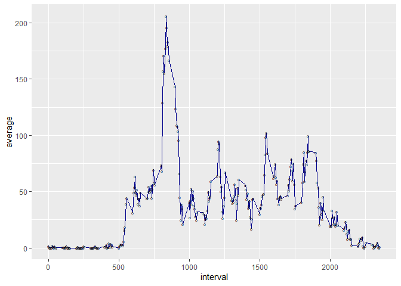
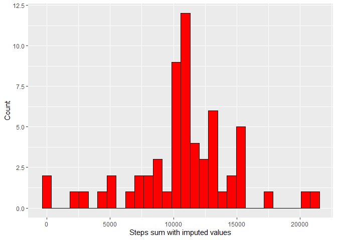
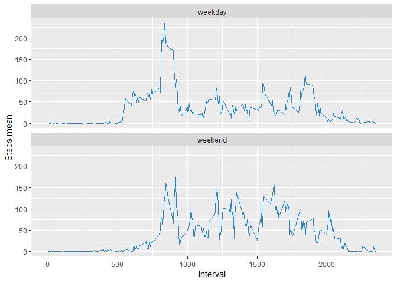

## Introduction

This report analyse data taken from a personal activity monitoring device. The device collects data at 5 minutes intervals through out the day.

The report is organised in the following sections:

-   [Loading and preprocessing the data](#loading-and-preprocessing-the-data)
-   [Plotting the histogram of total number of steps taken each day and calculating mean and median](#what-is-mean-total-number-of-steps-taken-per-day)
-   [Time series of the average number of step taken and calculating the time interval with maximum number of steps](#what-is-the-average-daily-activity-pattern)
-   [A strategy for imputing missing data and plotting a histogram of total number of steps taken each day with the new imputed data](#imputing-missing-values)
-   [A comparison of the average number of steps taken in the different intervals between weekdays and weekends](#are-there-differences-in-activity-patterns-between-weekdays-and-weekends)

## Loading and preprocessing the data

The data can be downloaded from their online repository or, if available, from a local directory. It also creates a `figure` subfolder to store the produced images. 


```r
if(!file.exists("./data/activity.csv"))
{
    link <- "https://d396qusza40orc.cloudfront.net/repdata%2Fdata%2Factivity.zip"
    temp <- tempfile()
    download.file(link, temp)
    df.data <- read.csv(unz(temp, "activity.csv"))
    unlink(temp)
} else
{
    df.data <- read.csv("./data/activity.csv")
}

dir.create(file.path('./figures'))
```

```
## Warning in dir.create(file.path("./figures")): '.\figures' already exists
```

Two further columns are added to the data: a factor variable `day` that removes the year in date (for readibility reasons) and a factor variable `daytype` indicating if the day is a weekday or a weekend.  


```r
df.data <- mutate(df.data, 
                  day = factor(sub("2012-", "", df.data$date)),
                  daytype = factor(ifelse(weekdays(as.Date(df.data$date, format = "%Y-%m-%d")) %in% c("Saturday","Sunday"), "weekend", "weekday")))

knitr::kable(head(df.data))
```


 steps  date          interval  day     daytype 
------  -----------  ---------  ------  --------
    NA  2012-10-01           0  10-01   weekday 
    NA  2012-10-01           5  10-01   weekday 
    NA  2012-10-01          10  10-01   weekday 
    NA  2012-10-01          15  10-01   weekday 
    NA  2012-10-01          20  10-01   weekday 
    NA  2012-10-01          25  10-01   weekday 

## What is mean total number of steps taken per day

The following is the plot of the histogram of the total number of steps taken each day


```r
df.data %>%
    group_by(date) %>%
    summarise(sum_step = sum(steps, na.rm = TRUE)) %>%
    ggplot(aes(x = sum_step)) +
        geom_histogram(color = "black", fill = "red")
```

<!-- -->

```r
    ggsave("./figures/sum_hist.png")
```

The mean and median of the total number of steps taken each day.


```r
stepsum <- df.data %>% 
    group_by(date) %>%
    summarise(ssum = sum(steps, na.rm = TRUE))

mean.steps <- round(mean(stepsum$ssum),2)
median.steps <- median(stepsum$ssum)
```

- the mean is `mean.steps`: 9354.23 
- the median is `median.steps`: 10395

# What is the average daily activity pattern

- time series plot (i.e. type = "l") of the 5-minute interval (x-axis) and the average number of steps taken, averaged across all days (y-axis)

```r
stepaverage <- df.data %>% 
    group_by(interval) %>%
    summarise(average = mean(steps, na.rm = TRUE))
    
ggplot(stepaverage, aes(interval, average)) +
    geom_line(color = "darkblue") +
    geom_point(shape = 'o')
```

<!-- -->

```r
ggsave("./figures/stepaverage.png")

misteps <- stepaverage[stepaverage$average == max(stepaverage$average),]$interval
```

- the five minute interval that, on average, contains the maximum number of steps is `misteps` = 835 


## Imputing missing values

The total number of missing values is calculated with:


```r
n.missing <- sum(is.na(df.data))
```

- `n.missing` = 2304

The strategy chosen for imputing missing variables is by considering the mean of the 5-mins intervals during the recorded 2 months and replace the missing value. `stepsumimp` is the new dataset, equal to the original used so far, that contains the new information.


```r
impute.mean <- function(x) replace(x, is.na(x), mean(x, na.rm = TRUE))

stepsumimp <- df.data %>%
    group_by(interval) %>%
    mutate(
        imputedsteps = impute.mean(steps),
    )

knitr::kable(head(stepsumimp))
```


 steps  date          interval  day     daytype    imputedsteps
------  -----------  ---------  ------  --------  -------------
    NA  2012-10-01           0  10-01   weekday       1.7169811
    NA  2012-10-01           5  10-01   weekday       0.3396226
    NA  2012-10-01          10  10-01   weekday       0.1320755
    NA  2012-10-01          15  10-01   weekday       0.1509434
    NA  2012-10-01          20  10-01   weekday       0.0754717
    NA  2012-10-01          25  10-01   weekday       2.0943396

The histogram of the total number of steps taken each day after the missing values are imputed is the following:


```r
stepsumimp %>%
    group_by(date) %>%
    summarise(sum_step_imp = sum(imputedsteps, na.rm = TRUE)) %>%
    ggplot(aes(x = sum_step_imp)) +
    geom_histogram(color = "black", fill = "red")
```

<!-- -->

```r
ggsave("./figures/sum_hist_imp.png")
```

## Are there differences in activity patterns between weekdays and weekends

A panel plot comparing the average number of steps per each interval across weekdays and weekends is produced with the following code:


```r
dailypattern <- df.data %>%
    group_by(interval, daytype) %>%
    summarise(intervalav = mean(steps, na.rm = TRUE))

ggplot(dailypattern, aes(interval, intervalav)) +
    geom_line(color = "dodgerblue2") +
    facet_wrap(~daytype, ncol = 1)
```

<!-- -->

```r
ggsave("./figures/dailypattern.png")
```

The plot shows that on the weekends a slightly more actibity is performed in the afternoon (but maybe with a slower start).
